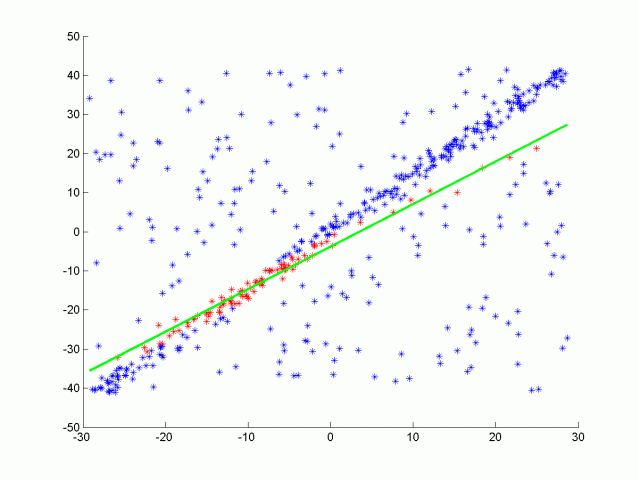

method ref to http://pointclouds.org/documentation/tutorials/extract_indices.php#extract-indices

## RANSAC

One type of RANSAC version selects the smallest possible subset of points to fit. For a line, that would be two points, and for a plane three points. Then the number of inliers are counted, by iterating through every remaining point and calculating its distance to the model. The points that are within a certain distance to the model are counted as inliers. The iteration that has the highest number of inliers is then the best model. This will be the version that you will implement in this quiz.

Other methods of RANSAC could sample some percentage of the model points, for example 20% of the total points, and then fit a line to that. Then the error of that line is calculated, and the iteration with the lowest error is the best model. This method might have some advantages since not every point at each iteration needs to be considered. It’s good to experiment with different approaches and time results to see what works best.
