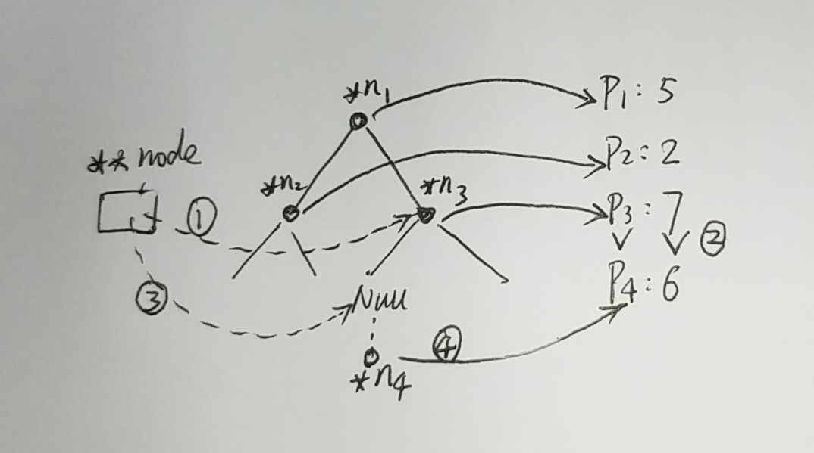
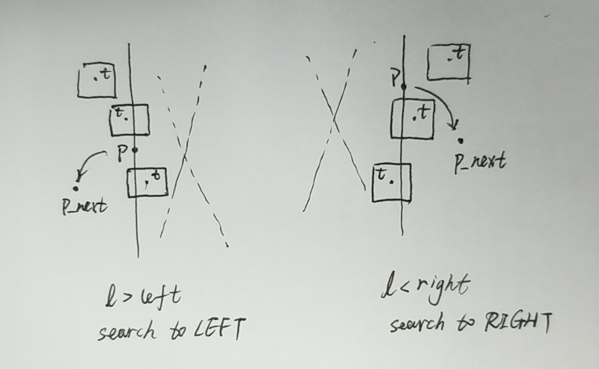
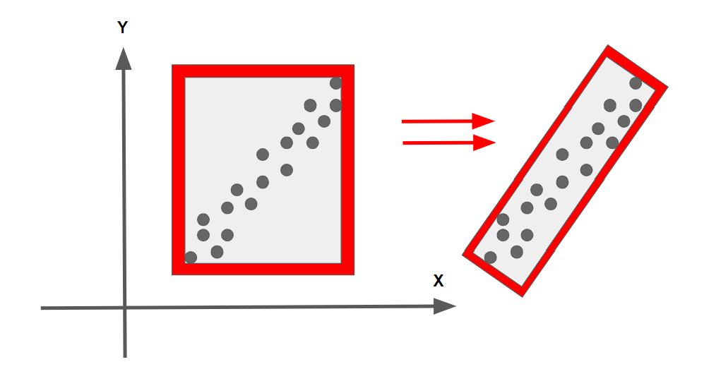

## Euclidean Clustering
The idea is you associate groups of points by how close together they are. To do a nearest neighbor search efficiently, you use a KD-Tree(binary) data structure which, on average, speeds up your look up time from O(n) to O(log(n)). This is because the tree allows you to better break up your search space. By grouping points into regions in a KD-Tree, you can avoid calculating distance for possibly thousands of points just because you know they are not even considered in a close enough region.

PCL library implementation:
http://pointclouds.org/documentation/tutorials/cluster_extraction.php   lines 71-82.

### KD-Tree


#### Improving the Tree:
Having a balanced tree that evenly splits regions improves the search time for finding points later. To improve the tree, insert points that alternate between splitting the x region and the y region evenly. To do this pick the median of sorted x and y points.
Sort by x then pick x (lower)median then sort by y and pick y to inesrt.

#### insert:


```
Double Pointer
void insert(BinaryTreeNode **node, int data)
   {
      if(*node == NULL)
      {
        *node = getNewNode(data);
      }
      else if(data < (*node)->data)
      {
        insert(&(*node)->left, data);
      }
      else
      {
        insert(&(*node)->right, data);
      }
   }
   or Pointer Reference
void insert(BinaryTreeNode *&node, int data)
   {
      if(node == NULL)
      {
        node = getNewNode(data);
      }
      else if(data < node->data)
      {
        insert(node->left, data);
      }
      else
      {
        insert(node->right, data);
      }
   }
```

#### search:


#### euclidean clustering
```
Proximity(point,cluster):
    mark point as processed
    add point to cluster
    nearby points = tree(point)
    Iterate through each nearby point
        If point has not been processed
            Proximity(cluster)

EuclideanCluster():
    list of clusters 
    Iterate through each point
        If point has not been processed
            Create cluster
            Proximity(point, cluster)
            cluster add clusters
    return clusters
```
#### PCA BOX

  
 In the above image, the bounding box on the right is more efficient, containing all the points with the minimum area required. It would be nice to take into account box rotation in the XY plane, about the Z axis. Rotation about the X or Y axes would yield weird results, since the car in the majority of situations is not concerned with the Z dimension, or has any control over Z movement.
 
 The file containing the box struct is located in src/render/box.h and contains an additional struct called BoxQ. This struct has a quaternion member that allows rotations. Also there is an additional renderBox function in render.cpp that takes a BoxQ argument and renders the rotational box. There is a blog post about fitting the smallest possible 3D box around a 3D point cloud here. The solution in the post uses PCA, principal component analysis and includes Z axis rotations as well. A challenge problem is then to find the smallest fitting box but which is oriented flat with the XY plane

http://codextechnicanum.blogspot.com/2015/04/find-minimum-oriented-bounding-box-of.html
