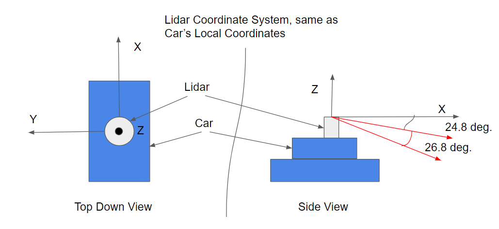

- With 64 layers, an angular resolution of 0.09 degrees, and average update rate of 10Hz the sensor collects (64x(360/0.08)x10) = 2,880,00 every second

While scanning with a VLP 64, a laser signal from the top layer takes 66.7 ns to be emitted and received again. The laser is emitted at a -24.8 degree incline from the X axis and horizontally travels along the X axis. Knowing that the speed of light is 299792458 m/s, what would be the coordinates of this laser point (X,Y,Z) in meters?
- First the distance of the ray is calculated. Iit takes 66.7 ns to do a round trip, so it takes half that time to reach the object. The distance of the ray is then 299792458 (66.7/2) 10e-9 = 10 meters. The ray is traveling along the X-axis so the Y component is 0. The X, and Z components can be calculated by applying some Trig, X component = 10m sin(90-24.8) = 9.08 , Z component = 10m -cos(90-24.8) = -4.19.
