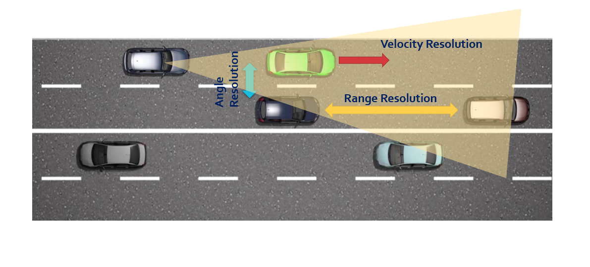
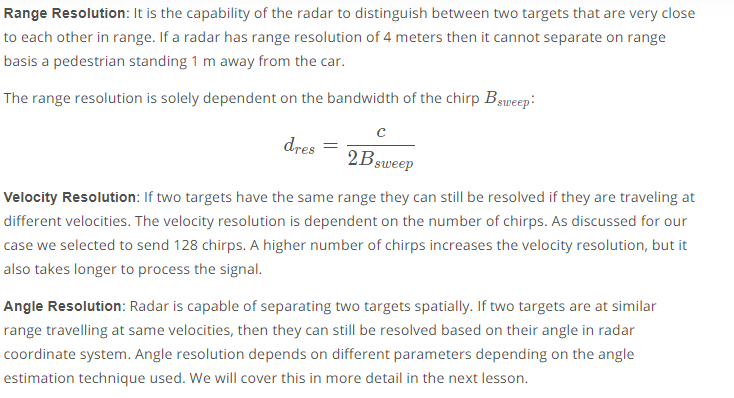

## Range, Velocity, and Angle Resolution

# Range Estimation Overview

Radar determines the range of the target by measuring the trip time of the electromagnetic signal it radiates. It is known that EM wave travels at a known speed (300,000,000 m/s), so to determine the range the radar needs to calculate the trip time. How?

Answer : By measuring the shift in the frequency.

## Range Estimation Equation

## System Level Range Calculation

As seen in the image above, the Synthesizer generates FMCW chirp for a given B_{sweep}B and T_sT . Let’s say the signal gets transmitted at 77GHz and it returns to the radar after hitting the target in a certain time duration. The radar receiver captures the signal, processes (subtraction) and measures the frequency delta between received signal and linearly ramping signal. This delta in frequency is called as beat frequency and it is proportional to the trip time. So based on the equation above, the radar calculates the range.

## Doppler Estimation

For additional resources related to doppler estimation, see these:
http://www.phys.uconn.edu/~gibson/Notes/Section6_3/Sec6_3.htm

## Fast Fourier Transform (FFT)
### FFT Overview

Learn more on FFT implementation
https://www.youtube.com/watch?v=t_NMmqTRPIY&feature=youtu.be

### FFT and FMCW

## The 2D FFT

