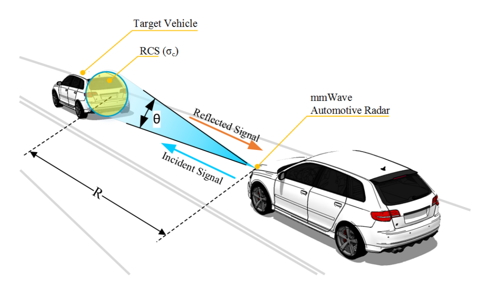
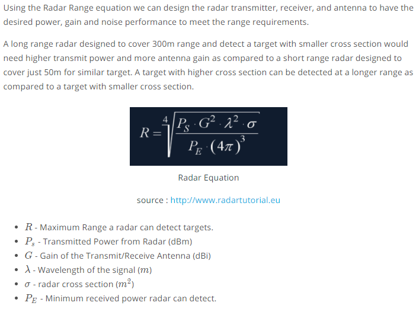

## Radar Construction

The automotive radars are small size sensors that can easily fit beneath the front grill or the bumper. As seen in the image above a radar module comprises of different parts.

- **Radar Dome or Radome**: A radome is a structural, weatherproof enclosure that protects a radar antenna. The radome is constructed of material that minimally attenuates the electromagnetic signal transmitted or received by the antenna, effectively transparent to radio waves.

- **Radar Printed Circuit Board**: This is analog hardware that includes the radar transceiver and antenna needed for radio wave generation.

- **Printed Circuit Board and Processing**: This includes the Digital Signal Processing (DSP) unit.

## Radar vs Lidar

Radar lacks the capability to generate a high resolution image, but it has highly accurate velocity estimation based on the doppler phenomenon, which we will cover in more detail later in this course. Also, radar wavelength allows it to sense the targets in bad weather conditions as well. Most important is the low manufacturing cost for a Radar. A radar unit can cost as low as a few hundred dollars, allowing a car manufacturer to deploy multiple Radar sensors for 360 degree perception. Tesla relies on Radar as its primary sensor and doesn’t include LIDAR in its sensor fusion system.

## Single Wave Parameters

The frequency of a wave is the number of waves that pass by each second, and is measured in Hertz (Hz). The automotive radar generally operates at W band (76GHz - 81GHz). The signal at this frequency is referred to as millimeterWave since the wavelength is in mm.

The Bandwidth of a signal is the difference between the highest and the lowest frequency components in a continous band of frequencies.

The Amplitude is the strength of the signal. Often it corresponds to the power of the RF signal/electromagnetic field defined in dB/dBm. It is relevant while configuring the output power of the radar and sensing the received signal. Higher the amplitude of the Radar signal, more is the visibility of radar. Automotive Radar can operate at max of 55 dBm output power (316 W)

dB, dBm, mW, and W conversions can be found https://www.rapidtables.com/electric/dBm.html.

P(dBm) = 10 ⋅ log10( P(mW) / 1mW)

## FMCW Chirps

## FMCW Hardware Overview

- **Frequency Synthesizer**: The frequency synthesizer is the component that generates the frequency to bring the chirp frequency all the way to 77GHz in case of automotive radar.

- **Power Amp**: The power amp amplifies the signal so the signal can reach long distance. Since the signal attenuates as it radiates, it needs higher power (amplitude) to reach targets at greater distances.

- **Antenna**: The antenna converts the electrical energy into electromagnetic waves which radiate through the air, hit the target, and get reflected back toward the radar receiver antenna. The Antenna also increases the strength of the signal by focusing the energy in the desired direction. Additionally, the antenna pattern determines the field of view for the radar.

- **Mixer**: In FMCW radar, the mixer multiplies the return signal with the sweeping signal generated by the frequency synthesizer. The operation works as frequency subtraction to give the frequency delta - also known as frequency shift or Intermediate frequency (IF). IF = Synthesizer Frequency - Return Signal Frequency.

- **Processor**: The processor is the processing unit where all the Digital Signal processing, Detection, Tracking, Clustering, and other algorithms take place. This unit could be a microcontroller or even an FPGA.

## The Antenna Pattern

The antenna pattern is the geometric pattern of the strengths of the relative field emitted by the antenna.

The beamwidth of the antenna determines the field of view for the radar sensor. If the requirement for the radar is to just sense the targets in its own lane then the beamwidth needs to be small enough to cover the complete lane up to desired range. If the beamwidth is wider than the lane width, it will sense the targets in the other lanes as well.

Antenna radiation not only comprises of the main beam but the sidelobes as well. Antenna sidelobes are critical because they can generate false alarms and pick interference from undesired direction. As seen in the pattern, the sidelobes of the antenna point in different directions and can sense targets that are not in the main beam. To avoid sidelobe detections it is critical to suppress the sidelobe levels to more than 30dB from the peak of the main beam.

## Radar Cross Section

## RCS Units

## Range Equation Overview

The image above shows the variation in the signal strength level as it travels through transmitter, over the air and at the receiver

The image above shows the variation in the signal strength level :

- The transmitter power
- Power Amplifiers further increase the signal strength - Transmit chain gain
- Signal is further amplified using an antenna
- One Way Path Loss represents the loss in the signal strength as it travels towards the target
- On getting reflected from the target the signal gets amplified based on the RCS of the target
- After RCS gain the signal travel back towards the radar and has similar loss in strength as going forward
- The receiver antenna amplifies the return signal before sending it to the processing unit

