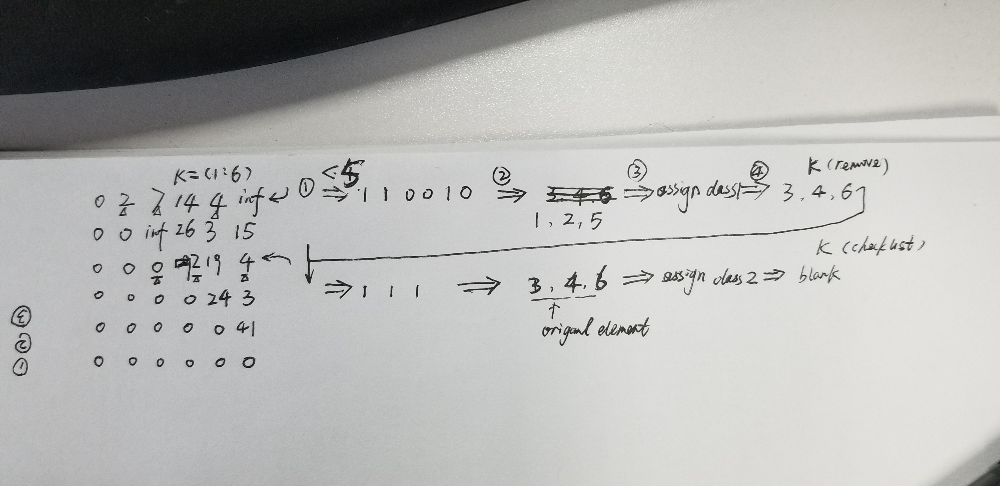

## Clustering
Due to the advancements in radar technology and increasing sensing resolutions, a radar can generate detections from plentitude of scattering points on the target. If a tracker is assigned to every detection from the same target, then it can overburden the processing unit. Hence, it is important to cluster the detections from every target and assign a single track for each.

The clustering implementation above uses the following 2 main steps:

- 1. Initial the distance Matrix

    - 1. If the detections are from same sensor, then loop through every single detection point and measure the euclidean distance between all of them.
    - 2. Keep running the loop until the detection list is empty

- 2. Loop for clustering:

    - 1. Pick the first detection in the check list and check for its clustering neighbors.
    - 2. If the distance between the first pick and remaining detections is less than the vehicle size, then group those detections and their respective radar sensor measurements, including range and velocity.
    - 3. For the group, take the mean of the range and velocity measurements.

    Note: the radar measurement vector has 6 values - where range and velocity for x and y coordinates reside at indices 1,2, 4, and 5: [x, y, - , Vx, Vy, -]

    - 4. Create a new Cluster ID. Then, assign all the group detections to the same ID.

    - 5. Further, assign cluster, the mean range and velocity.

    - 6. In the end, delete from the list the detections which have already been assigned to a cluster.
    - 7. Keep repeating the process until the detection list is empty.
    

